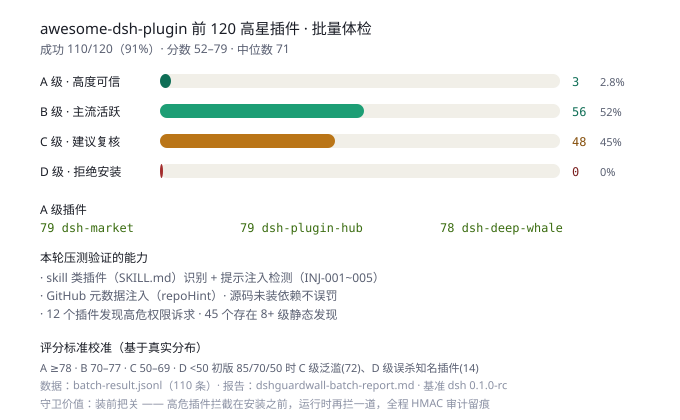

# dsh-guardwall

DeepSeek Harness 的安全插件，**安装前体检 + 运行时护栏**双层防线 —— 装前把关、装后看门、全程留痕。

## 第一层 · 安装前体检（v0.2 新增）

**"装这个插件 = 给了它什么权限？"** —— 装之前先回答这个问题：

```bash
npx guardwall check <spec>              # 只体检输出报告
npx guardwall add <spec> [--force]      # 体检 → 门禁通过才安装（包装 dsh plugin add）
# spec：本地路径 / npm 包名 / github:owner/repo
```

四步体检：

1. **权限清单**：静态分析源码，列出插件会访问的**文件路径**（~/.ssh、.env、云凭据…）、**执行的命令**（rm、curl、sudo…）、**连接的域名**（正常 API / SSRF 元数据 / 遥测端点）
2. **静态风险扫描**：依赖树 + 危险模式（eval、动态执行、密钥读取、SSRF 目标、无约束递归删除、混淆载荷、安装脚本）
3. **信任评分 A–D**：维护活跃度（GitHub stars/推送时间）· 代码质量 · 已知漏洞（npm audit）· 来源可信度 · 运行时健康（依赖是否齐全）五维加权
4. **安装门禁**：D 级拒绝（`--force` 才放行）、C 级警告、A/B 放行

Agent 侧同步提供 `guard_check` 工具——在对话里问"这个插件安全吗"就能拿到体检报告。体检接口：`GET /plugins/dsh-guardwall/vet?spec=<pkg>`。

真实体检演示（本机实测）：

```
dshmarket@1.10.1         → 67/100 C 级 → WARN
  权限：常规路径 · 命令执行 · raw.githubusercontent.com（拉插件列表，合理）
  风险：动态命令拼接若干（它内部 spawn pnpm，符合预期）
vision-toolkit@0.1.2     → 57/100 C 级 → WARN
  风险：动态 require/import、动态网络请求、写入未知路径
```

### 批量压测：awesome-dsh-plugin 前 120 高星插件

对社区精选目录按 stars 取前 120 个插件全量体检（clone + 扫描），覆盖率 91%（110/120），
并基于真实分布校准了评分阈值（A≥78 / B 70–77 / C 50–69 / D<50）。



校准过程修复的误判（100+ 样本验证）：
- **skill 类插件**（只有 SKILL.md 无 package.json）现可识别，并新增**提示注入检测**（INJ-001~005：忽略指令 / 伪装系统 / 提示词泄露 / 隐瞒行为 / 绝对服从）
- **GitHub 元数据**：package.json 缺 repository 字段时用外部 `repoHint` 注入仓库名查询（维护活跃度不再丢分）
- **源码 clone 未装依赖**不再误判"依赖缺失"（曾把 dsh-TUI 2222★ 误杀为 D 级）
- 测试目录 / 内置模块动态导入不再污染扫描结果

## 第二层 · 运行时护栏（v0.1）

- **输入侧拦截**：在工具调用执行前扫描参数，命中高危规则（破坏性命令、凭据路径、SSRF 云元数据、反向 shell、命令链注入、提权）**直接拦截**并返回结构化错误
- **输出侧审计**：监听工具结果，检测密钥/私钥泄露、内网 IP、带口令数据库串、环境变量 dump，记录审计并告警
- **防篡改审计**：所有事件写入 **HMAC 链式哈希**审计日志，任何一条被篡改整条链失配——可出示的合规证明
- **零运行时依赖**：仅用 Node 内置模块（crypto/fs/path），自身无供应链风险

> 与社区 51 个安全插件的差异（调研结论）：44 个是静态扫描（对运行时动态构造的命令全盲）；
> 运行时拦截的 7 个都依赖 cordis/dsh-tools（与恶意插件同框架）。本插件零依赖 +
> 密码学链式审计收据 + 标准 `tools/execute` / `tools/result` 事件接入。

## 热加载（v0.4）· 改规则不用重启

把"经常改的东西"从代码里抽出来，改完**秒级生效**：

- **自定义规则**：`~/.dsh/cache/dsh-guardwall/rules.d/*.json` 放自定义检测规则，保存即生效
  ```json
  [
    { "id": "MY-001", "direction": "input", "risk": 8,
      "re": "internal\\.corp\\d+\\.com", "summary": "禁止访问内网域名", "advice": "确认授权后访问" }
  ]
  ```
- **热配置**：同目录 `config.json` 改阈值立即生效
  ```json
  { "blockThreshold": 6, "warnThreshold": 3 }
  ```
- 工具：`guard_reload` 手动刷新 · `guard_rules` 查看生效规则与热加载状态

## 安装

```bash
# 方式一：npm 发布版（推荐）
dsh plugin --profile web add dsh-guardwall

# 方式二：GitHub 源码
dsh plugin --profile web add "github:iiiweiii/dsh-guardwall#main"

# 方式三：CLI 门禁自带（已 clone 仓库时）
node bin/guardwall.mjs check <spec>
```

重启 `dsh web` 后生效。验证：

```bash
dsh --profile web --dump-config | grep -A2 'id: guardwall'
```

## 拦截示例

Agent 被诱导执行 `rm -rf /` 时，工具调用会被替换为：

```
Error: dsh-guardwall 拦截了该调用（规则 SEC-001 · 风险 10/10）
原因：破坏性删除/格式化/磁盘写入
建议：禁止对根目录/家目录/系统盘执行删除或格式化；如确需清理，改用回收站或限定路径后二次确认
如需放行，请用户明确确认后调用 guard_whitelist 临时放行（或调整策略阈值）。
```

## 规则表

输入侧（`tools/execute` 前检查，可拦截）：

| ID | 风险 | 检测 |
|---|---|---|
| SEC-001 | 10 | 破坏性删除/格式化/磁盘写入（rm -rf /、format、mkfs、dd 到块设备） |
| SEC-002 | 9 | 访问凭据/密钥文件（~/.ssh、.aws、.env、.netrc 等） |
| SEC-003 | 9 | 参数中出现疑似明文凭据（password=、sk-、AKIA、ghp_） |
| SEC-004 | 9 | SSRF：云元数据端点（169.254.169.254 / metadata 域名） |
| SEC-005 | 10 | 反向 shell / 下载执行管道（bash -i、nc -e、/dev/tcp、curl\|sh） |
| SEC-006 | 8 | 命令链注入（;rm、&&rm、反引号执行） |
| SEC-007 | 8 | 提权/权限变更（sudo su、chmod 777 /） |
| SEC-008 | 9 | 系统关键文件/设备写入（/etc/passwd、/boot、SYSTEM32） |
| SEC-009 | 5 | 对外发布操作（git push / npm publish，默认放行但审计） |

输出侧（`tools/result` 后审计，只读观察）：

| ID | 风险 | 检测 |
|---|---|---|
| OUT-001 | 10 | 密钥/私钥泄露（sk-、AKIA、Bearer、BEGIN PRIVATE KEY） |
| OUT-002 | 6 | 内网 IP 输出 |
| OUT-003 | 8 | 带口令数据库连接串 |
| OUT-004 | 8 | 环境变量密钥 dump |
| OUT-005 | 7 | 公钥/证书/私密材料 |

## 策略

默认：`risk >= 7` 拦截（block）、`risk >= 4` 放行但告警（warn）、其余仅记录（record）。
可在 `cordis.patch.yml` 的 `config` 调整：

```yaml
- insert:
    - id: guardwall
      name: dsh-guardwall
      config:
        blockThreshold: 7
        warnThreshold: 4
        dataDir: ~/.dsh/cache/dsh-guardwall
```

## 工具

| 工具 | 用途 |
|---|---|
| `guard_status` | 今日拦截/告警/记录统计、最近事件、审计链完整性（防篡改证明）、白名单 |
| `guard_whitelist` | 临时放行某规则（rule + tool 模式 + 分钟数），用户明确确认误报时使用 |

审计接口：`GET /plugins/dsh-guardwall/audit`（JSON：统计 + 链完整性 + 最近 20 条）。

## 审计日志格式

数据落在 `~/.dsh/cache/dsh-guardwall/`：

```
audit-YYYY-MM-DD.jsonl   每日追加（每条含 prevHash + HMAC hash）
chain.key                链密钥（首次生成，0600 权限）
```

`verify()` 重新校验整条链：任何一条被篡改 → 返回 `{ok:false, brokenAt:n}`。
**篡改即暴露**，这就是"不可抵赖"的审计收据。

## 权限与数据

- 本地读写 `~/.dsh/cache/dsh-guardwall/`；无网络调用、无遥测
- 拦截动作只影响 Agent 的工具调用结果，不修改宿主配置

## 兼容性

- 真机验证：`@deepseek-ai/dsh 0.1.0-rc.5`（web profile，拦截/审计/接口实测通过）
- `tools/execute`（可拦截）、`tools/result`（只读）为宿主标准事件，见
  `packages/core/tools/src/index.ts`；接口走 `webServer.register`（与 dshmarket 同款）
- 预览版 API 可能变动，若失效先看 `--dump-config` 与宿主升级日志

## 路线图

- [ ] 白名单按 agent/会话隔离
- [ ] 自定义规则（用户 YAML 规则表）
- [ ] 高敏操作二次确认（approval 集成）
- [ ] 审计导出 + 周报

## License

MIT
